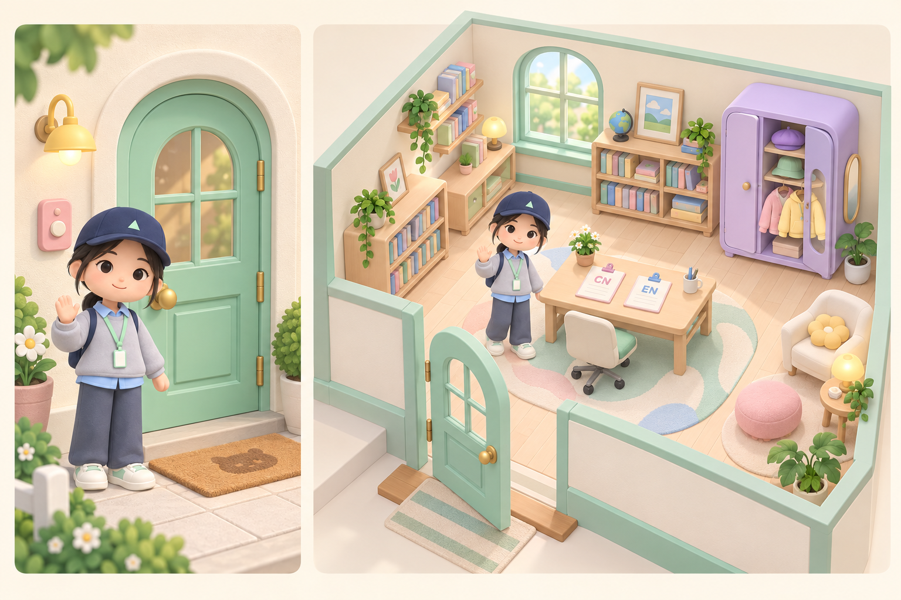

# 交互式 3D 个人主页：设计与实施方案

日期：2026-09-29。状态：美术方向已获确认；已按桌面键鼠操作修订，等待用户最终确认后才开始灰模。尚未实施或运行验证。

本阶段产出视觉方向、角色设定、交互方案和工程路线。现有首页及粒子效果继续保留。本目录以 `_` 开头，按 [Jekyll 默认规则](https://jekyllrb.com/docs/structure/)不进入站点产物；也不存放原始个人照片。

- [角色设定图](concepts/avatar-v1.png)：主体、正侧背视图、表情和换装方向。
- [门口与室内概念图](concepts/room-v1.png)：门铃、双语简历桌、书架与衣柜的位置和配色。
- [角色建模设定](avatar-spec.md)：照片参考特征、补充设计及服饰拆分。
- [完整图像提示词与检视记录](image-prompts.md)：使用内置 image_gen 生成。

本轮明确的范围：房间仅支持电脑网页版；方向键或 WASD 控制小人走动，鼠标点击物品进行交互。手机和平板使用现有普通网页及粒子效果，不提供移动端房间或触屏移动控件。以下细则是灰模实现的验收依据。

## 1. 目标与可行性

将个人主页扩展成一间可以探索的糖果色小书房：门口决定进入 3D 世界还是普通简历，桌上两份简历对应中文和英文，书架承载博客与论文，衣柜为个人角色换装。

技术上可行：一个小房间、一个角色和有限的互动对象，可采用纯前端 Three.js 场景，构建后与 Jekyll 产物一起部署到 GitHub Pages。首版不需要服务器、数据库或账户系统。主要工作量在角色建模、键鼠控制、动作与镜头衔接、桌面性能和内容阅读体验；移动设备继续使用普通网页。

本次是结合仓库检查和官方文档得到的架构判断，不代表已完成性能测试。概念图是外观参考，不能直接作为可旋转、可绑定动作的 3D 模型。

## 2. 当前仓库与接入位置

| 当前内容 | 已核对的情况 | 接入方案 |
| --- | --- | --- |
| `index.md` / `index_zh.md` | 英文、中文简历源文件 | 继续作为简历唯一编辑来源 |
| `_layouts/default.html` | 导航、侧栏、正文、粒子画布和脚本入口 | 保留作为普通版布局，后续增加进入 3D 房间的入口 |
| `assets/js/particles.js` | 普通页面的粒子背景 | 普通版继续使用；房间使用独立布局与脚本 |
| `assets/js/language.js` | 根据 localStorage 的 `lang` 重定向，并拼接 `_zh.html` | 接入时改为显式路由映射；房间内切语言不重载场景 |
| `blog/index.md` | 已有博客索引，读取 `site.posts` | 书架可以复用博客数据；尚未发现实际文章 |
| `CV.pdf` | 当前有一份 PDF | 保留下载入口，不假设已有两份不同语言 PDF |
| 构建部署 | 有 Jekyll 配置与 Gemfile；本地未发现 `.github/workflows/` | 后续核对 GitHub Pages 的实际构建来源，再接入 Node 构建步骤 |

用户说明已有 GitHub Actions 自动搭建；本地缺少工作流文件，尚不能确认当前是否使用 Pages 的默认 Jekyll 工作流。无需为本阶段改动部署设置。

## 3. 体验路线

### 门口

电脑端首次访问看到小房间外的一小块门廊，角色站在门旁，轻轻挥手。奶油白墙面、薄荷绿门、粉色门铃和暖黄色灯光构成主要视觉。移动端按第 6 节的规则直接进入普通网页，不展示 3D 门廊。

- 点击门或“推门进入”：门绕铰链打开，角色走进去，镜头随之平滑进入室内。
- 点击门铃或“普通主页”：轻微按压反馈后，进入所选语言的普通简历页面。
- 两个选择始终带清晰文字，不能让访客猜门铃的含义。
- 在 3D 加载前就提供真正的 HTML 普通版链接；即使脚本或模型失败仍能访问经历。
- 加载先展示门廊，点击进入后再加载室内和额外衣服；不让所有衣服拖慢首次访问。
- 声音默认关闭，可在用户操作后开启。
- 门廊内同样使用方向键 / WASD 行走；靠近门或门铃后点击相应物体。门口的 HTML“推门进入 / 普通主页”按钮始终可用，进入动画可短暂接管角色，结束后立即归还控制。

### 室内与小人

采用第三人称、稍俯视的柔和透视镜头：既能看到角色，也能看清家具。探索时镜头朝向固定，只做有限的位置跟随；桌子、书架、衣柜各有预设近景，关闭交互面板后恢复探索镜头。首版不提供鼠标自由旋转镜头，保持方向键的空间对应关系稳定。

| 输入 | 行为 |
| --- | --- |
| `W` / `↑` | 沿地面向画面上方前进 |
| `S` / `↓` | 沿地面向画面下方前进 |
| `A` / `←`、`D` / `→` | 沿地面向画面左、右移动 |
| 两个相邻方向键 | 斜向移动，合成向量归一化，速度不增加 |
| 鼠标悬停 | 可交互物品高亮并显示名称；超出距离时提示先靠近 |
| 鼠标左键 | 靠近后选择简历、书架、衣柜、门或门铃 |
| `Esc` / 面板关闭按钮 | 关闭当前阅读或换装面板，恢复原位置和探索镜头 |

- 角色朝移动方向平滑转身；速度按时间计算，保证不同帧率下步速一致。相反方向键同时按下时对应轴不移动。
- 鼠标点击地面不移动角色；点击远处物品只显示“请先靠近”，不自动寻路或瞬移。靠近后的一次点击直接触发交互，不要求精确调整角色朝向。
- 简历、书架和衣柜设置交互区域，初始距离阈值约 1.2 个场景单位，按灰模里的角色与家具尺度调试；判定参考可站立的交互点，而不是家具中心。
- 使用地面可行走边界与静态家具碰撞体，加入角色半径；分步处理位移与沿障碍滑动，避免斜走穿桌、低帧率穿墙和卡门。首版不需要导航网格或自动寻路。
- 点击物品时只选中最靠近视线的有效目标；墙、关闭的门与家具参与遮挡判断。给纸张配置足够大的拾取区域，但两份简历的拾取区域不能互相覆盖。
- 首次进入房间时提供简短提示：“WASD / 方向键移动 · 鼠标点击互动 · Esc 关闭”。鼠标保持可见，不锁定指针。
- 全程保留普通主页链接；提供可聚焦的物品操作按钮，键盘用户可用 Tab / Enter 触发与鼠标点击等价的动作，沿用距离规则。

### 键盘焦点与暂停规则

- 仅当房间交互区域获得焦点且处于可行走状态时响应移动键；方向键此时阻止页面滚动。
- 用户点击场景或完成推门进入后，场景获得焦点并有可见提示；Tab 可正常离开场景，不能困住页面焦点。
- 进入简历、书架或换装面板时立即清空按键状态，暂停角色移动；方向键、滚轮和文字输入恢复为面板的正常行为。
- 输入框、链接、按钮等页面控件获得焦点时不处理 WASD 移动；Ctrl / Alt / Meta 组合快捷键不触发行走。
- 窗口失焦、切换标签页或场景失去焦点时清空按键，防止松键事件丢失导致持续走动；恢复后必须重新按键。
- 关闭面板时恢复焦点，但不恢复关闭前仍记录为按下的键；用户重新按键后再移动。

### 桌上的两份简历

两份独立纸张放在桌面：粉色夹子标识“中文简历”，蓝色夹子标识“English CV”。颜色同时配文字，避免仅靠颜色区分。

1. 悬停或聚焦时，纸张微微抬起并出现名称。
2. 用户用方向键 / WASD 走到桌边，点击对应纸张后角色转向并伸手，纸张上浮、转向镜头；首版可以用简化手势。
3. 约 0.5–0.8 秒后，过渡到同样纸张外观的 HTML 阅读面板。
4. 面板展示对应 Markdown 生成的正文，可滚动、选择复制、点击链接；提供普通版打开和已有 PDF 下载。
5. 关闭或按 Esc 时纸张回桌，恢复镜头和原来的角色位置。

3D 负责“拿起纸张”的空间感，HTML 负责清晰阅读。正文不烘焙到模型贴图，也不要求把全部简历塞进一张 A4。较窄的电脑窗口使用接近全屏的阅读面板；手机和平板始终阅读普通网页，不使用房间的纸张面板。

### 书架

两组清晰命名的书架或书架分区：`Blog / 技术笔记` 与 `Publications / 论文`。

- 键盘走近后点击某一区，镜头靠近并展开文章 / 论文列表；书背数量可以简化，不随文章数量无限堆模型。
- 博客仍用 Jekyll `_posts`；论文后续用 `_data/publications.yml` 存标题、作者、年份、状态、链接。
- 点击条目打开可独立访问的文章或论文链接，浏览器后退可回房间对应区域。
- 当前没有条目时呈现“整理中 / Coming soon”，不编造论文或文章。
- 新增内容主要编辑 Markdown / YAML，无需重新布置 3D 场景。

### 衣柜

用键盘走到衣柜前的交互区域，点击衣柜后柜门打开，角色原地转向镜子，镜头转为能看到全身的角度。换装期间暂停行走输入。

- 首批帽子：深蓝棒球帽、薰衣草贝雷帽、薄荷渔夫帽，另有不戴帽子选项。
- 首批上衣：默认灰色卫衣与蓝色领口、浅粉开衫、奶油黄连帽衫。
- 帽子和衣服独立选择；提供恢复默认装扮。
- 换装保存为当前访客浏览器的偏好，不更改所有访客看到的站点默认角色。
- `localStorage` 不可用时仍能即时换装，只是不保留到下次；字段带版本并校验合法选项。
- 首版只更换预制网格与材质，使用统一骨架；帽子锚点、头发显隐和领口位置需要实际检查穿模。

## 4. 空间与美术



房间采用约 6 × 5 个场景单位的单层小书房；这只是布局起点，不是实际尺寸承诺。

```text
                 后墙 / 柔和窗光
┌────────────────────────────────┐
│ 博客书架      窗户       论文书架 │
│                                │
│       桌子：中文 CV / EN CV       │
│                                │
│   角色活动区 / 软地毯      衣柜   │
│                                │
└──────── 门 + 门铃 ───────────────┘
                 小门廊
```

进入后可弱化或隐藏靠近镜头的墙，确保角色与互动对象可见。门口和室内是同一空间的两种镜头状态；无需加载开放世界。

概念图用切开墙体的展示视角说明空间关系；实际游览时镜头更靠近角色。门的开合方向、通道宽度、门铃与书架文字标签在原型中校正，装饰数量也可按性能预算缩减。

视觉关键词：动物森友会一类生活模拟游戏的亲切感、原创人类角色、圆润几何、少量分面、磨砂材质、柔和接触阴影、糖果色。模型保持简洁的可辨轮廓，细节集中在脸、帽檐、领口和家具边缘。

| 色彩 | 色值 | 用途 |
| --- | --- | --- |
| 奶油白 | `#FFF4DE` | 墙面、纸张、整体底色 |
| 薄荷绿 | `#A9DFC5` | 门、衣柜局部、交互点 |
| 草莓粉 | `#F2B6C8` | 中文简历夹子、软装 |
| 天空蓝 | `#ABD4EE` | 衬衫领口、英文简历夹子 |
| 奶油黄 | `#F4D982` | 灯光、椅子、服装 |
| 薰衣草紫 | `#C7B8E7` | 帽子、书架分区 |
| 深海军蓝 | `#303B59` | 默认棒球帽、正文与少量深色锚点 |

文字保持足够深的颜色；糖果色主要用于物体和装饰。概念图的颜色以最终模型材质与浏览器灯光调试为准。

角色详见 [avatar-spec.md](avatar-spec.md)。

## 5. 技术路线

推荐 **Three.js + TypeScript + Vite** 实现独立房间应用，**Blender → GLB** 制作正式模型，保留 Jekyll 管理普通页面和内容。Vite 仅参与构建，浏览器加载静态 JS/CSS/模型；此项目规模无需为房间引入完整 React 应用。

Three.js 的 `GLTFLoader` 可加载 glTF 2.0，`Raycaster` 可用于模型拾取，动画系统可播放角色动画。它们覆盖模型加载与点击交互的基础能力；键盘移动、碰撞、交互状态和 HTML 阅读层仍需项目自行实现。[GLTFLoader](https://threejs.org/docs/pages/GLTFLoader.html)、[Raycaster](https://threejs.org/docs/pages/Raycaster.html)、[AnimationMixer](https://threejs.org/docs/pages/AnimationMixer.html)。

首版采用 WebGL 2 渲染路径，并提供能力检测、加载失败和上下文丢失时的普通版入口。当前 Three.js `WebGLRenderer` 基于 WebGL 2；兼容性与设备表现仍需真机验证。[WebGLRenderer](https://threejs.org/docs/pages/WebGLRenderer.html)。

### 模块边界

```text
Jekyll 内容源
├─ index.md / index_zh.md ── 普通版 HTML
│                        └─ 生成给房间使用的简历内容
├─ _posts                ── 博客页面 / 书架索引
└─ _data/publications.yml ── 论文索引

独立房间应用
├─ scene / camera / lighting
├─ avatar / movement / animation
├─ interaction / state-machine
├─ resume-reader / shelf-panel / wardrobe-panel
└─ preferences / loading / fallback
```

简历内容在构建时由 Jekyll 从两个首页源文件生成：使用稳定的 front matter 标识查找源页，`markdownify` 处理正文，`jsonify` 输出内容接口，或直接嵌入房间模板。实现时验证构建顺序、字符转义和段落结构，确保只维护一份正文。3D 应用不抓取整个普通页面，也不复制另一套简历数据。

优先使用轻量 CSS / DOM 动画完成纸张阅读层的过渡；3D 镜头与物体动画由同一状态机管理。复杂物理、布料模拟和自由搭建家具不在首版范围内。

### 交互状态

```text
PORCH ──推门──> ENTERING ──> ROOM
  │                           ├─靠近并点击─> PICKING_UP ──> READING_CV
  └─门铃─> CLASSIC_PAGE        ├─> BROWSING_SHELF
                              └─> CHANGING_OUTFIT

READING_CV / BROWSING_SHELF / CHANGING_OUTFIT ──关闭──> ROOM
ROOM ──回门口──> PORCH
任意状态 ──普通版链接──> CLASSIC_PAGE
```

`ROOM` 内按键切换 idle / walk，不创建自动寻路任务。开门、拿纸和放回期间锁定重复操作，打开面板时清空并暂停移动输入；同时只能打开一个面板。Esc / 关闭按钮返回上一稳定状态，并恢复焦点。浏览器后退需要同步处理房间中的阅读面板状态；页面离开时停止渲染并清空输入。

## 6. URL 与现有页面共存

采用分阶段切换，先验证新增房间，再将门口作为电脑端首页；移动端首页始终使用普通网页。

| 路径 | 原型阶段 | 正式入口切换后 |
| --- | --- | --- |
| `/` | 当前英文普通版 | 电脑进入门口；移动设备进入对应语言普通版 |
| `/room/` | 电脑进入新增房间；移动设备进入当前普通版 | 电脑可直接访问 3D；移动设备转入对应语言普通版 |
| `/classic/en/` | 在入口切换前准备 | 英文普通版，仍来自 `index.md` |
| `/classic/zh/` | 在入口切换前准备 | 中文普通版，仍来自 `index_zh.md` |
| `/index_zh.html` | 原有中文页面 | 保留兼容入口，跳转中文普通版 |
| `/blog/`、`/CV.pdf` | 继续可用 | 继续可用 |

正式切换时给两个 Markdown 源文件指定普通版 `permalink`，新增根页面使用房间布局。`/index.html` 和 `/` 本来是同一个静态首页，无法在同一路径同时保留英文简历和门口；后续英文普通版采用明确的新地址，并检查站内旧链接。

语言按钮采用一份显式配置映射各语言普通版路径、房间文案与简历 ID；明确访问的中文 / 英文简历优先于历史 `lang` 偏好，避免被自动跳转到另一种语言。所有生成链接考虑 Jekyll 的 `baseurl`。

门铃使用房间当前界面语言；电脑普通页面提供“进入 3D 房间”。电脑默认每次从网站主入口进入门口；直接访问普通版地址时保持普通版，不强制回门口。“记住普通版偏好”可作为后续可选项，不能使门铃和门的选择失效。

### 电脑与移动设备分流

- 在请求 Three.js、房间 CSS、模型和贴图之前运行轻量入口判断，符合电脑条件才动态加载房间应用。移动设备直接使用当前语言的普通网页及原有粒子效果，不下载房间资源。
- 综合浏览器提供的移动设备信号、手机 / 平板识别及精细指针能力判断；不只根据屏幕宽度决定。平板请求桌面版网站、触屏笔记本与窄窗口需要专门验证。
- 首版对明确的手机 / 平板或无法确认具备电脑键鼠交互条件的设备采用普通版；带鼠标或触控板的电脑可进入房间。外接鼠标的手机 / 平板仍不作为房间支持目标。
- 电脑浏览器缩窄窗口只调整房间和面板布局，不突然跳到普通版。会话中不因一次窗口尺寸或输入设备变化丢失阅读状态。
- `/` 和 `/room/` 使用同一入口规则，语言通过明确映射传递；原型阶段移动端指向现有普通版地址，正式切换后指向 `/classic/en/` 或 `/classic/zh/`，防止回跳循环。
- 普通版页面始终独立可访问；移动端隐藏进入房间的操作入口。无 JavaScript 时至少保留明确的中英文普通版链接。
- 静态站点无法完全可靠地识别每一种设备伪装，因此采用保守分流，并把真实手机 / 平板直接访问 `/room/` 的行为列为验收项。

## 7. 模型生产与可替换资源

分两步生产资产：

1. **可交互灰模**：用 Three.js 几何体搭房间和简单角色，验证镜头、走动、家具点击、简历过渡与换装接口。
2. **正式美术资产**：依据角色设定在 Blender 建模、UV / 材质、绑定、制作动作；导出 GLB，替换灰模并优化。

程序化几何很适合首版验证和简洁家具。角色脸部、帽檐、衣服轮廓与动作权重需要进一步美术迭代。图片生成负责概念探索，不将一张概念图当作自动完成的可动画网格。

| 资产 | 首版需求 |
| --- | --- |
| 门廊与房间 | 房间壳体、门和门铃可独立操作，门轴正确 |
| 家具 | 桌子、椅子、两组书架、衣柜、镜子装饰、少量软装 |
| 简历 | 两张可独立拾取的纸、语言标牌 |
| 角色 | 一套人类基础模型与统一骨架 |
| 装扮 | 三顶帽子、三套上衣；无帽状态完整头发 |
| 动画 | idle、walk、wave、reach、look；开门和纸张动画可程序控制 |

镜子首版可用装饰面或低成本角色展示，不要求实时镜面反射。复杂后处理和实时多光源阴影不是保证可爱观感的前提。

## 8. 性能、阅读与降级目标

以下均为待测的设计预算，不是当前测量结果：

- 门口启动所需 JS/CSS/模型/贴图，传输总量目标不超过约 2 MB；进入完整房间的累计资源目标约 8 MB 以内。
- 电脑目标 60 FPS；低性能桌面设备可降低画质或切换普通版，以实际测试设备记录，不宣称覆盖所有设备。移动设备不承担 3D 性能目标。
- 初始可见场景目标约 10 万三角形以内、100 次 draw calls 以内；角色基础网格约 6k–12k 三角形，按可见装扮实际统计。
- 对高分辨率屏和低性能电脑限制像素比，按需减少实时阴影和装饰；重复书籍共享网格和材质，额外服装按需加载。
- 在高分辨率屏、后台标签页和静态阅读阶段降低无必要渲染；释放不再使用的模型、贴图和监听器。
- 禁用 JavaScript、WebGL 2 不可用、模型加载失败时，HTML 普通版链接始终可用。
- 尊重 `prefers-reduced-motion`，用短淡入替代走近和推进镜头；关闭音效不影响功能。
- 电脑阅读面板使用可聚焦的语义化对话框；支持 Tab、Esc、焦点返回、方向键与鼠标滚动。移动端继续使用普通版现有响应式布局。
- 简历与文章保留独立静态 HTML、标题与分享链接，保证内容可检索和直接访问。

## 9. 实施里程碑与验收

| 阶段 | 产出 | 验收点 |
| --- | --- | --- |
| A：本阶段 | 美术方向确认、桌面键鼠方案、移动端分流方案 | 用户确认修订后的方案，才开始灰模 |
| B：最小纵向原型 | `/room/` 灰模；键盘角色；碰撞；门 / 门铃；两份可读简历；书架和衣柜占位 | 完成“门口 → 键盘走动 → 点击中文或英文简历 → 关闭 → 普通版”；移动端不加载房间 |
| C：角色与室内美术 | 正式 GLB、灯光、材质、基础动作 | 轮廓接近概念图、移动自然、视线无遮挡、桌面纸张清晰可点 |
| D：换装与书架 | 帽子 / 上衣组合、持久化、文章与论文数据入口 | 所有组合无明显穿模；刷新保存；空内容状态明确 |
| E：兼容性与上线 | 桌面性能分级、设备分流、降级、导航兼容、自动构建 | 电脑键鼠可用；移动端直达普通版；资源路径正确；普通版与 PDF 均可访问 |

最值得先做的是阶段 B：它能在美术投入前验证网页核心阅读流程与工程接入。后续先把默认角色和房间做完整，再扩展服饰数量。

方案已经覆盖灰模所需的输入、空间、内容、平台分流和退出路径。以下项目需通过灰模验证和调整，不再作为开始灰模前的未定需求。

### 灰模验收清单

1. 方向键与 WASD 都可持续移动；松键立即停止；斜向速度一致；切换窗口后没有卡键；页面控件和阅读面板内不会误走动。
2. 角色无法穿墙、穿桌、穿衣柜或越出门廊；卡到边角时可以退回；开门后能够通行。
3. 鼠标点击地面不移动；远处点击物品给出靠近提示；近处点击中文 / 英文纸张打开正确正文；被遮挡物品不能隔墙点击。
4. 纸张拿起与放回动作完整，Esc、关闭按钮和浏览器后退不会造成重复面板、角色移动或镜头残留。
5. 门口的推门和门铃分流正确，普通版及 PDF 均可访问；语言不会被历史偏好强制改错。
6. 衣柜和两组书架有明确的占位与点击反馈；灰模衣柜可用简单帽子形状 / 上衣颜色验证更换接口，正式服装、模型细节与完整内容留待后续阶段。
7. 手机 / 平板访问 `/` 或 `/room/` 进入正确语言普通版，网络记录中没有房间脚本、模型和贴图请求；电脑窄窗口仍可操作。
8. WebGL 不可用、模型加载失败或减少动态效果时，普通版入口可用；灰模阶段用生成失败 / 网络失败模拟资源异常。

上线前再验证装扮存储不可用、桌面 Chrome / Edge / Firefox / Safari、低动态效果、设备识别边界和实际性能预算。浏览器与设备范围是测试目标，尚未声明通过兼容性验证。

## 10. 构建和运行安排

遵循本机主要用于开发的约定：本阶段不安装运行依赖、不启动站点、不在本机编译工作区。后续提供运行机器可执行的脚本和命令。

建议新增内容的结构如下，均是未来规划，并非已经创建的实现：

```text
room-app/                  # TypeScript 源码、package.json、锁文件、Vite 配置
_layouts/room.html         # 独立房间布局
room/index.html            # 初期 /room/ 入口
room/content.json          # Jekyll 生成的内容入口（layout: null）
assets/room/               # 构建后的 JS/CSS
assets/models/             # 正式 GLB 与贴图
_data/room_assets.json     # 从 Vite manifest 生成的资源映射
_data/publications.yml     # 后续论文数据
scripts/build-site.mjs     # 编排并校验最终产物路径
.github/workflows/pages.yml
```

构建先执行锁定依赖的 Node / Vite 构建，生成资源及 Jekyll 可读的 manifest，再执行 Jekyll 构建，最后将完整 `_site` 上传到 Pages。Vite 的 `base` 与 Jekyll `baseurl` 统一；将 `room-app/`、Node 依赖、构建脚本和设计文件明确排除出站点产物。现有 Gemfile 与锁文件的未提交状态需保留并在实施时核对。

Vite 支持输出静态构建产物，GitHub Pages 支持自定义 Actions 工作流上传并部署站点 artifact；因此可以把两套构建串接起来。[Vite 静态部署](https://vite.dev/guide/static-deploy.html)、[GitHub Pages 自定义工作流](https://docs.github.com/en/pages/getting-started-with-github-pages/using-custom-workflows-with-github-pages)。具体 workflow 须在核对当前 Pages 设置后实现。

未来运行机器的命令约定：先 `npm ci --prefix room-app` 和 `bundle install`，再调用后续编写的统一构建脚本；由它构建资源、生成 manifest、执行 Jekyll。当前尚无这些前端脚本，不能把上述结构视为已经可运行。
