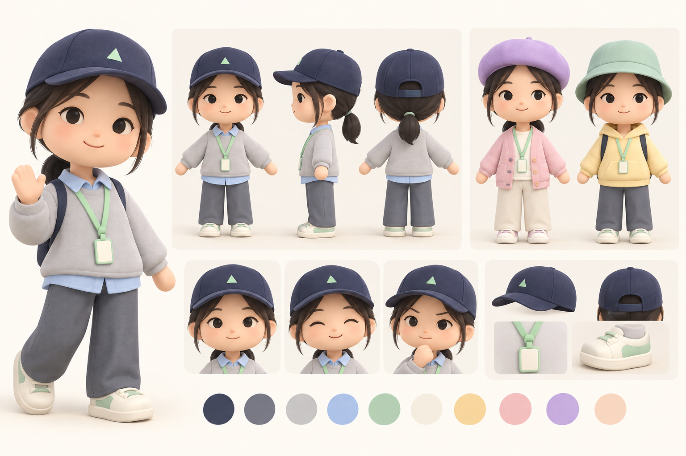

# 角色设定：礽曦 / Zhixin

更新：2026-09-30。状态：用户已接受灰模，精细模型第一版已细化脸部、发束、帽檐、领口、挂绳、鞋子，以及开衫和连帽衫的不同结构。当前是程序化部件与关节组动画，尚无 Blender / GLB 和蒙皮权重。本文仍是后续美术定稿基准，运行方法见 [预览说明](../../room-app/README.md)。

## 设计取向

设计一名亲切、安静、有研究者气质的原创人类小人。参考照片中可见的外观和穿着，以圆润几何、糖果色和简洁可动画的结构表达；不是写实数字分身。

## 来自照片的识别特征

- 深色直发，脸颊两侧留自然垂下的发束。
- 柔和的椭圆脸、深色眼睛、自然眉形和轻微闭嘴微笑。
- 深蓝棒球帽，浅灰色卫衣与浅蓝衬衫领口。
- 鲜绿色挂绳作为色彩识别点，简化为薄荷青柠色挂绳与空白胸牌。

照片没有提供完整后脑和全身：低束发、裤子和鞋子属于本稿补充设计，不是从照片确认的事实。照片上的品牌文字不作为角色标识复刻。

## 形体与材质

| 部分 | 设定 |
| --- | --- |
| 比例 | 总高约 2.7 个头高，头部偏大；脸部保留自然五官关系 |
| 身体 | 短而圆润的躯干，胶囊形四肢，小手以简单手套状为主 |
| 脸 | 深棕眼睛、简洁眉毛、小鼻子、淡淡腮红；避免夸张发光大眼 |
| 头发 | 深棕黑色整块发束，后部暂设计成短低束发；可从背面调整 |
| 帽子 | 深海军蓝棒球帽，简化弧形帽檐；小块薄荷色几何装饰，无字标 |
| 默认上衣 | 浅灰卫衣、天蓝衬衫领口、薄荷青柠挂绳 |
| 下装 | 深灰蓝宽松长裤（设计补充） |
| 鞋 | 奶油白运动鞋、薄荷色小面积点缀（设计补充） |
| 表面 | 大面积哑光、圆角、软阴影；不制作真实皮肤、发丝或布料绒毛 |

角色上的海军蓝和深色头发提供识别度；糖果色主要放在领口、衣服变体、帽子变体和房间里。让换装改变心情，同时保留同一张脸和同一发型。

## 初始衣柜

| 类别 | 默认 | 变体 1 | 变体 2 |
| --- | --- | --- | --- |
| 帽子 | 海军蓝棒球帽 | 薰衣草紫贝雷帽 | 薄荷绿渔夫帽 |
| 上衣 | 浅灰卫衣 + 蓝色领口 | 草莓粉开衫 | 奶油黄连帽衫 |
| 裤鞋 | 深灰蓝长裤 + 白薄荷鞋 | 首版沿用 | 首版沿用 |

帽子还提供“无帽”；帽子与上衣独立组合，不锁成整套。概念图中成套展示只是为了方便比较。首版不制作随动作摆动的真布料；挂绳与衣服固定跟随躯干，后续再考虑轻微次级动画。

预览修订：无帽时加入完整发顶与偏分刘海，鬓发衔接脸颊，低马尾补足体积和长度；戴帽时保留帽下头发，并按帽型调整发顶体积，避免秃顶或穿帽。

## 表情与动作

- 表情：默认轻微微笑、开心、专注；由简洁眉眼和嘴部形变实现。
- 待机：轻微呼吸、偶尔眨眼、小幅看向鼠标或当前目标。
- 门口：短挥手；推门进入使用走路和手臂伸出衔接。
- 行走：由方向键 / WASD 控制，短步幅，手臂轻摆，速度与位移匹配；平滑转向移动方向，松键停止。
- 简历：用户用键盘走近桌子，鼠标点击纸张后角色看向纸张并伸手；拿起动画可用程序曲线控制纸张，阅读期间暂停行走。
- 衣柜：轻转身展示服装，换装后一次小幅开心反馈。

## 建模与导出交接

角色基础体目标约 6k–12k 三角形，实际以渲染效果和性能为准。所有服装共享身体比例和骨架；头部、帽子、头发、上衣、下装、鞋和可选挂绳应有稳定命名。

建议命名：`AvatarRoot`、`Head`、`HairBase`、`HairUnderHat`、`HatAnchor`、`Hat_*`、`Top_*`、`Bottom`、`Shoes`、`Badge`。角色统一朝向、脚底原点、尺寸和骨骼变换；帽子绑定到头部锚点。正式衣服采用一致的绑定姿势和蒙皮权重，避免换装后动作错位。

无帽时必须展示完整头发，戴帽时仅替换容易穿帽的顶部发片。连帽衫的帽兜默认放下；检查其与低束发、脖颈和帽子背部的交叠。袖口、胳膊、裤腰和所有帽型在 idle / walk / reach 状态均需查看。

导出 GLB 时核对材质、透明模式、色彩空间、动画名称与循环边界。首版优先共用小贴图或颜色材质。概念图的前后侧视图仅提供方向，建模时仍需统一轮廓、细节和比例。

## 后续建模校验重点

1. 保留已确认概念图中的脸、帽子、头发组合和圆润比例，实际网格各角度保持一致。
2. 默认灰蓝服装与糖果色换装沿用当前方向；不因灰模简化改变最终美术目标。
3. 实际步幅、转身和伸手动作与碰撞体匹配，换装后不出现明显穿模。

当前版本已加入待机呼吸、眨眼、行走摆臂和伸手；更多表情、挥手、坐姿及换装反馈仍待制作。后续继续按以上要点校验各视角和动作下的形体，不将本轮网格等同于最终美术定稿。
